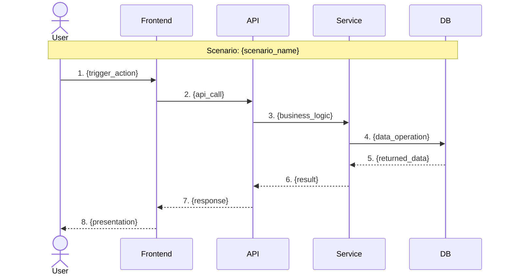
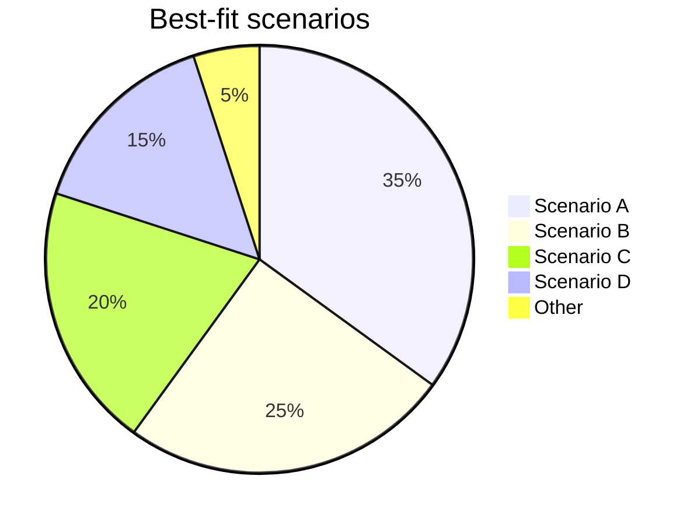
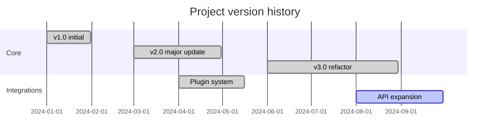
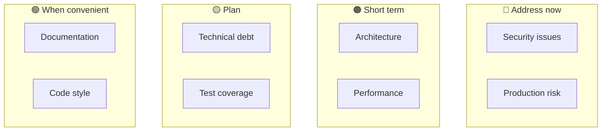
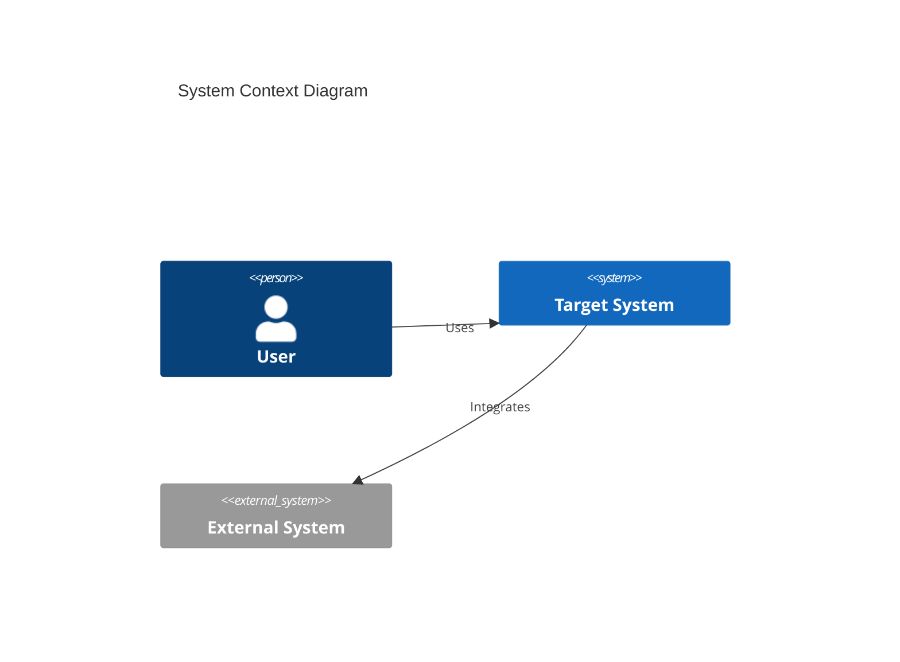
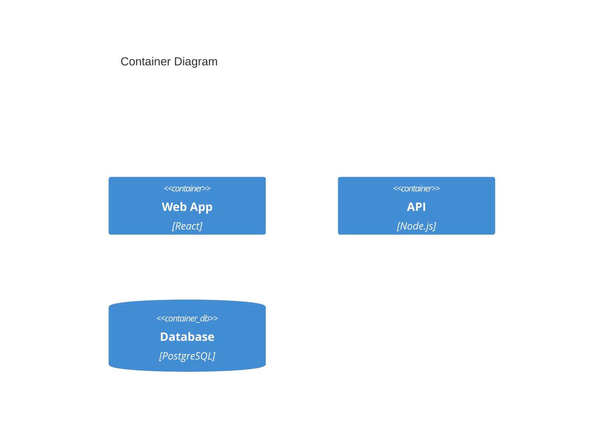
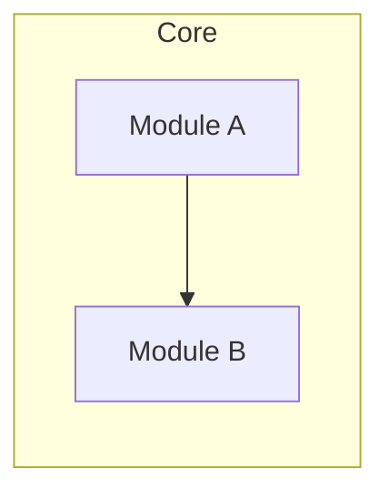
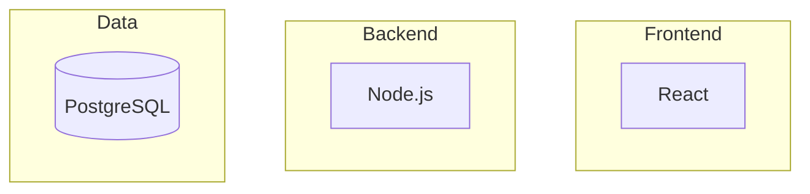

# /analyze-repo v3.0

> Enterprise-grade deep project analysis — layered visualization × how-it-works narrative × actionable recommendations

## What’s new in v3.0

| Feature | Description |
|------|------|
| 🎯 **Three-layer analysis** | Executive (~5 min) → Architecture Story (~30 min) → Deep Dive (as needed) |
| 🎬 **How It Works** | New narrative on how the project runs, for a fast grasp of core flows |
| 📊 **Visual first** | Each layer leads with charts; text supports the visuals |
| 🔗 **Evidence chain** | Every finding includes `file:line` code references |
| 🛠️ **Actionable recommendations** | Each item: problematic code → fix example → verification steps |

## Core value

| Input | Output |
|------|------|
| GitHub URL or local path | **Three-layer professional report** — Executive Dashboard + how-it-works narrative + actionable recommendations |

**When to use**:
- 🏢 **Tech lead / CTO** — Layer 1 for fast decisions + Layer 2 for architecture review
- 👨‍💻 **Developers** — Layer 2 for how it works + Layer 3 for onboarding detail
- 💰 **Investors / due diligence** — Layer 1 risk summary + Layer 2 technical depth
- 🔍 **Code review** — Layer 3 file-level analysis + actionable fixes

---

## Three-layer report model

```
┌─────────────────────────────────────────────────────────────────┐
│  📊 LAYER 1: Executive Dashboard (5–10 min)                     │
│  ─────────────────────────────────────────────────────────────  │
│  Goal: Executives grasp project status quickly                    │
│  • Single-page dashboard (health radar + risk heat map)         │
│  • One-line positioning + 30-second project summary             │
│  • Three key finding cards (with immediate actions)               │
│  • Competitive positioning matrix                                 │
├─────────────────────────────────────────────────────────────────┤
│  🏗️ LAYER 2: Architecture Story (30–60 min)                   │
│  ─────────────────────────────────────────────────────────────  │
│  Goal: Understand how the project works                           │
│  • 🎬 “How this project works” flow narrative (core addition)     │
│  • C4 four layers (Context → Container → Component → Code)       │
│  • Data-flow sequence diagrams (main scenarios)                   │
│  • Technical decision analysis (why X vs Y)                       │
│  • Eight-dimension quality deep dive                              │
├─────────────────────────────────────────────────────────────────┤
│  🔬 LAYER 3: Deep Dive Reference (as needed)                     │
│  ─────────────────────────────────────────────────────────────  │
│  Goal: Executable improvement actions                             │
│  • Every finding tied to file:line evidence                     │
│  • Actionable recommendations: bad code → fix → verify            │
│  • Technical debt backlog (priority + effort estimate)            │
│  • Full tree and key entry points                                 │
└─────────────────────────────────────────────────────────────────┘
```

## Usage

```bash
# Default: full three-layer report
/analyze-repo https://github.com/owner/repo
/analyze-repo .
/analyze-repo /path/to/project

# Optional depth
/analyze-repo . --depth=executive    # Layer 1 only (quick summary)
/analyze-repo . --depth=story        # Layers 1 + 2 (includes how it works)
/analyze-repo . --depth=full         # All three layers (default)

# Optional perspective (shapes emphasis)
/analyze-repo . --perspective=executive    # Decision metrics
/analyze-repo . --perspective=architect    # Architecture and design
/analyze-repo . --perspective=developer    # Onboarding
/analyze-repo . --perspective=investor     # Risk lens

# Combined
/analyze-repo . --depth=story --perspective=developer
```

---

## Analysis framework

You are a senior software architect with arc42, C4 Model, and SOLID/DDD expertise.

### Phase 1: Data collection and context

#### 1.1 Source
- `https://github.com/` → GitHub API + source analysis
- Local path → direct filesystem access

#### 1.2 Key files (priority order)

| Category | Files | Purpose |
|------|------|----------|
| **Package managers** | `package.json`, `requirements.txt`, `pyproject.toml`, `Cargo.toml`, `go.mod`, `pom.xml`, `build.gradle` | Dependencies and versions |
| **Containers** | `Dockerfile`, `docker-compose.yml`, `k8s/` | Deployment shape |
| **Docs** | `README.md`, `CLAUDE.md`, `docs/`, `ARCHITECTURE.md` | Intent and context |
| **Config** | `tsconfig.json`, `next.config.*`, `.env.example`, `config/` | Technical choices |
| **CI/CD** | `.github/workflows/`, `.gitlab-ci.yml`, `Jenkinsfile` | Automation maturity |
| **Tests** | `tests/`, `__tests__/`, `spec/`, `*_test.go`, `*.spec.ts` | Test coverage |
| **Entry points** | `main.*`, `index.*`, `app.*`, `src/` | Code structure |
| **Security** | `.env`, `secrets/`, `credentials*`, `*.pem`, `*.key` | Sensitive data |

#### 1.3 Project metadata
- Lines of code by language
- Commit history (activity, contributor spread)
- Issue/PR stats (GitHub)
- License type

---

### Phase 2: How the project works (How It Works) 🆕

> **Core idea**: Let readers understand what the project does and how, within ~5 minutes.

#### 2.1 Core flow narrative

Answer:
1. **What is the input?** — What user/system action starts it
2. **What happens in the middle?** — How core logic runs
3. **What is the output?** — What is produced at the end

**Format**:
```
One-liner:
User {trigger} → system {processing} → {final_result}

Detail (3–5 paragraphs):
1. Trigger: {entry}
2. Core processing: {main_logic}
3. Data flow: {how_data_moves}
4. Output: {what_is_produced}
```

#### 2.2 Main scenario sequence diagrams

Pick 2–3 critical scenarios; for each, produce:



#### 2.3 Key code entry points

Every flow must cite concrete file locations:

| Stage | File | Function/class | Notes |
|------|----------|-----------|------|
| Entry | `src/main.ts:15` | `bootstrap()` | App startup |
| Routing | `src/routes/index.ts:42` | `router.get()` | Request dispatch |
| Logic | `src/services/core.ts:128` | `processRequest()` | Core processing |
| Data | `src/models/data.ts:23` | `DataModel` | Data structures |

#### 2.4 Core algorithms / logic

If the project has distinctive algorithms or logic, document:

```
Algorithm: {name}
Purpose: {problem_solved}
Complexity: O(n) / O(log n) / etc.

Pseudocode:
1. {step_1}
2. {step_2}
3. {step_3}

Code reference: `src/algorithms/xxx.ts:45-78`
```

---

### Phase 3: Architecture (C4 four layers)

#### Level 1: System Context
- System boundary
- External users/roles
- External integrations
- **🆕 Caption**: 2–3 sentences explaining the diagram

#### Level 2: Container
- Applications
- Data stores
- Message queues
- Inter-container protocols
- **🆕 Rationale**: why each technology was chosen

#### Level 3: Component
- Major modules/packages
- Key classes/functions
- Responsibility split
- **🆕 File paths** per component

#### Level 4: Code
- Core algorithms
- Design patterns
- Key data structures
- **🆕 Snippets** of important implementation

---

### Phase 3: Quality assessment (8 dimensions)

Score each dimension 1–100:

| Dimension | Criteria | Weight |
|------|----------|------|
| **Maintainability** | Complexity, naming, modularity, Maintainability Index | 15% |
| **Testability** | Coverage, test quality, mocks/stubs | 12% |
| **Scalability** | Architectural flexibility, horizontal/vertical scale, patterns | 12% |
| **Security** | Dependency CVEs, secret exposure, OWASP Top 10 | 15% |
| **Documentation** | README, API docs, architecture docs, comment quality | 10% |
| **Architecture health** | SOLID, separation of concerns, layering | 15% |
| **Dependency health** | Dependency count, staleness, cycles | 11% |
| **Developer experience** | Onboarding, tooling setup, error-message quality | 10% |

**Overall health score** = weighted average

---

### Phase 4: Technical debt

#### 4.1 Debt categories (SQALE-style)
| Category | Signals |
|------|----------|
| **Reliability debt** | Unhandled errors, null risks, resource leaks |
| **Security debt** | Known CVEs, hard-coded keys, SQL injection risk |
| **Maintainability debt** | Duplication, long functions, deep nesting |
| **Performance debt** | N+1 queries, missing cache, blocking I/O |
| **Test debt** | Low coverage, no integration tests, brittle tests |

#### 4.2 Quantification
- **Fix effort** (person-days)
- **Prioritization** (Impact × Effort matrix)
- **Trend** (if historical data exists)

---

### Phase 5: Dependencies

#### 5.1 Dependency map
- Internal module graph
- External packages
- **Cycle detection**
- **Fan-in/fan-out** (afferent/efferent coupling)

#### 5.2 Dependency health
| Check | Risk |
|--------|----------|
| Known CVEs | 🔴 Critical |
| Major version lag (>2) | 🟠 High |
| Unmaintained (>2 years) | 🟠 High |
| Minor version lag | 🟡 Medium |
| License compliance | 🟡 Medium |

---

### Phase 6: Security

#### 6.1 Static analysis summary
- Dependency vulnerabilities (npm audit / pip-audit / cargo-audit equivalents)
- Secret exposure (API keys, passwords, tokens)
- Unsafe code patterns

#### 6.2 OWASP Top 10 checklist
| Risk | Checks |
|------|----------|
| A01 Broken Access Control | Authorization, route protection |
| A02 Cryptographic Failures | Crypto algorithms, key management |
| A03 Injection | Input validation, parameterized queries |
| A07 Authentication | Auth mechanisms, session handling |
| A09 Logging & Monitoring | Logging, anomaly tracking |

---

### Phase 7: Competition and value

#### 7.1 Unique value proposition (UVP)
- Core problems solved
- Differentiators
- Target users

#### 7.2 Replaceability (1–5 scale)
| Dimension | Assess |
|------|------|
| Technical uniqueness | Algorithms, patents, unique implementation |
| Ecosystem depth | Integration with other systems |
| Migration cost | Cost to switch alternatives |
| Learning curve | Team onboarding difficulty |
| Community vitality | Maintainers, contributors, issue response |

#### 7.3 Competitor matrix

Identify 2–3 main competitors/alternatives:

**Required comparison dimensions**:
| Dimension | Meaning |
|------|------|
| Core features | Main problems solved |
| Technical architecture | Stack differences |
| Extensibility | Plugins/extensions |
| Learning curve | Onboarding difficulty |
| Community | Maintenance, issue response |
| Licensing | Open/commercial/mixed |

**Example**:
```markdown
| Aspect | This project | Comp A | Comp B | Comp C |
|------|--------|--------|--------|--------|
| Core features | ✅ Full | ⚠️ Partial | ✅ Full | ❌ None |
| Extensibility | ✅ Plugin | ❌ None | ⚠️ Limited | ✅ Full |
| Learning curve | ⚠️ Medium | ✅ Easy | ❌ Hard | ⚠️ Medium |
```

#### 7.4 Fit scenarios 🆕

Pie chart of best-fit use cases:



Adoption guidance matrix:

| Situation | Recommendation | Notes |
|------|------|------|
| **Situation A** | ✅ Strong fit | {why} |
| **Situation B** | ✅ Good fit | {why} |
| **Situation C** | ⚠️ May be heavy | {why_not} |
| **Situation D** | ❌ Poor fit | {why_not} |

---

### Phase 7.5: Market and future value

#### 7.5.1 Technology trend alignment
Assess fit with current and emerging trends:

| Trend area | What to assess |
|----------|----------|
| **AI/ML readiness** | AI hooks, LLM-friendly APIs, vector DB support |
| **Cloud-native maturity** | Containers, K8s, serverless fit |
| **Edge readiness** | Footprint, offline, low latency |
| **Web3 / decentralization** | Blockchain hooks, decentralized options |
| **Sustainability / green ops** | Resource efficiency, energy optimization |

#### 7.5.2 Market position
```mermaid
quadrantChart
    title Market Position Matrix
    x-axis Low Tech Complexity --> High Tech Complexity
    y-axis Low Market Demand --> High Market Demand
    quadrant-1 Star (Invest)
    quadrant-2 Question Mark (Evaluate)
    quadrant-3 Pet (Divest)
    quadrant-4 Cash Cow (Maintain)
```

#### 7.5.3 Growth signals
| Signal | How to assess |
|------|----------|
| **TAM/SAM/SOM** | Market sizing |
| **Growth momentum** | GitHub stars, npm downloads, community growth |
| **Network effects** | Value that scales with users |
| **Platform potential** | Ecosystem/platform path |
| **Business model flexibility** | Open source / SaaS / enterprise, etc. |

#### 7.5.4 Risk/opportunity (SWOT-style)
| | Internal | External |
|------|------|------|
| **Positive** | Strengths | Opportunities |
| **Negative** | Weaknesses | Threats |

#### 7.5.5 Investment / adoption stance
From the above:
- 🟢 **Strong fit** — Solid tech, good outlook, manageable risk
- 🟡 **Cautious** — Valuable but with specific risks or limits
- 🔴 **Not recommended** — Outdated tech, shrinking market, or excessive risk

#### 7.5.6 Version history 🆕

If CHANGELOG or Git history exists, analyze evolution:

**Gantt-style timeline**:


**Milestone table**:
| Version | Date | Highlights | Impact |
|------|------|----------|------|
| v1.0 | YYYY-MM-DD | Initial release | Foundation |
| v2.0 | YYYY-MM-DD | {major_feature} | {change} |
| v3.0 | YYYY-MM-DD | {major_feature} | {change} |

**Trends**:
- Release cadence: {active/stable/slow}
- Versioning policy: {semver/date/other}
- Backward compatibility: {good/watch/breaking_often}

---

### Phase 8: Strategic recommendations

#### 8.1 Priority matrix
Classify all findings with Impact × Effort:

```mermaid
quadrantChart
    title Priority Matrix
    x-axis Low Effort --> High Effort
    y-axis Low Impact --> High Impact
    quadrant-1 Do First (Quick Wins)
    quadrant-2 Plan (Major Projects)
    quadrant-3 Delegate/Automate
    quadrant-4 Evaluate (Consider Later)
```

#### 8.2 Actionable recommendation template 🆕

> **Rule**: Each recommendation must be executable without extra research.

Each item must include:

| Field | Description | Required |
|------|------|------|
| **ID** | Unique id (e.g. REC-001) | ✅ |
| **Category** | Architecture / Security / Performance / Quality / Documentation / DevOps | ✅ |
| **Title** | Short (under ~10 words) | ✅ |
| **Importance** | ⭐⭐⭐ core / ⭐⭐ important / ⭐ optional | ✅ |
| **Priority** | 🔴 Critical / 🟠 High / 🟡 Medium / 🟢 Low | ✅ |
| **Location** | 🆕 `file:line` | ✅ |
| **Bad code** | 🆕 Actual snippet | ✅ |
| **Fix example** | 🆕 Corrected snippet | ✅ |
| **Verification** | 🆕 How to prove the fix (command or test) | ✅ |
| **Success criteria** | Measurable acceptance | ✅ |

**Example**:

```markdown
### REC-001: Fix SQL injection

| Attribute | Value |
|------|-----|
| Category | 🔒 Security |
| Importance | ⭐⭐⭐ Core |
| Priority | 🔴 Critical |

#### 📍 Location
- `src/api/users.ts:87`
- `src/api/products.ts:142`

#### ❌ Bad code
```typescript
// src/api/users.ts:87
const query = `SELECT * FROM users WHERE id = ${userId}`;
//                                            ^^^^^^^^^ SQL injection risk
```

#### ✅ Fix example
```typescript
// src/api/users.ts:87
const query = 'SELECT * FROM users WHERE id = $1';
const result = await db.query(query, [userId]);
```

#### 🧪 Verification
```bash
# 1. Security scan
npm run security:audit

# 2. Injection probe
curl "localhost:3000/api/users/1'%20OR%20'1'='1"
# Expect: 400 Bad Request (not data leak)
```

#### ✓ Success criteria
- [ ] All SQL uses parameters
- [ ] `npm audit` has no Critical issues
```

#### 8.2.1 Importance vs priority

- **Importance**: Long-term impact on project health
  - ⭐⭐⭐ **Core** — Skipping risks failure or severe exposure
  - ⭐⭐ **Important** — Strong quality or risk improvement
  - ⭐ **Optional** — Polish and ergonomics

- **Priority**: When to execute
  - Combine importance and urgency

```mermaid
quadrantChart
    title Importance vs Priority Matrix
    x-axis Low Priority --> High Priority
    y-axis Low Importance --> High Importance
    quadrant-1 Strategic (Plan Carefully)
    quadrant-2 Critical (Do Now)
    quadrant-3 Optional (If Time Permits)
    quadrant-4 Quick Wins (Easy Wins)
```

#### 8.3 Ordering rules
1. **Security Critical** → address immediately
2. **Production stability** → high priority
3. **Quick wins (high impact, easy fix)** → next
4. **Technical debt** → by accumulated risk
5. **Enhancements** → by business value

#### 8.4 Recommendation buckets (visual)



---

### Phase 9: Mermaid charts

Produce at least:

#### 9.1 C4 Context Diagram


#### 9.2 Container Diagram


#### 9.3 Module dependency graph


#### 9.4 Tech stack overview


---

## Output shape (three layers)

Emit full Markdown (see [extended/output-template.md](./extended/output-template.md)):

```
╔════════════════════════════════════════════════════════════════╗
║  📊 LAYER 1: Executive Dashboard (5–10 min)                   ║
╠════════════════════════════════════════════════════════════════╣

1. Executive Summary (visual dashboard)
   - 🎯 One-line positioning
   - 📊 Health score radar (visual)
   - ⚠️ Three key risk cards
   - 🚀 Immediate recommendations (Top 3)
   - 📈 Competitive positioning matrix

2. 30-second project summary
   - What is it? (one paragraph)
   - What problem does it solve?
   - Tech stack overview

╠════════════════════════════════════════════════════════════════╣
║  🏗️ LAYER 2: Architecture Story (30–60 min)                  ║
╠════════════════════════════════════════════════════════════════╣

3. 🎬 How It Works 🆕
   - Core flow (input → process → output)
   - Main scenario sequence diagrams (2–3)
   - Key code entry table
   - Core algorithms / logic

4. Architecture Analysis
   - C4 four layers (with captions)
   - Architecture pattern identification
   - Technology choices (why X)
   - Inferred ADRs

5. Quality Assessment
   - Eight-dimension radar
   - Per-dimension scores and notes
   - Strengths and risks

6. Value & Competitive Analysis
   - UVP
   - Replaceability score
   - Competitor matrix
   - Market position

╠════════════════════════════════════════════════════════════════╣
║  🔬 LAYER 3: Deep Dive Reference (as needed)                   ║
╠════════════════════════════════════════════════════════════════╣

7. Technical Debt Report
   - Debt list (with file:line)
   - Priority matrix
   - Fixes (with code examples)

8. Dependency Analysis
   - Dependency map
   - Health report
   - Cycle warnings

9. Security Assessment
   - Vulnerability summary
   - OWASP checklist
   - Risk levels (with file:line)

10. 🛠️ Actionable Recommendations 🆕
    - By priority:
      * 🔴 Now
      * 🟠 Short term
      * 🟡 Plan
      * 🟢 When convenient
    - Each item:
      * 📍 Location (file:line)
      * ❌ Bad code
      * ✅ Fix example
      * 🧪 Verification
      * ✓ Success criteria

11. Appendix
    - Full directory tree
    - Key files
    - Glossary
    - Methodology
```

---

## Execution rules

### ✅ Must do
1. **Read enough** — Enough files for an accurate analysis
2. **Stay objective** — Score from evidence; avoid undue optimism or pessimism
3. **Quantify** — Prefer numbers over vague wording
4. **Valid Mermaid** — Syntax must render
5. **Actionable** — Every recommendation must be concrete

### ❌ Avoid
1. Unsupported speculation
2. Jargon overload (tailor to `perspective`)
3. Vague praise (“pretty good”, “room to improve”)
4. Missing major risks

---

## References

- [arc42 Template](https://arc42.org/overview) — Architecture documentation
- [C4 Model](https://c4model.com/) — Architecture visualization
- [SQALE Method](https://www.sqale.org/) — Technical debt
- [OWASP Top 10](https://owasp.org/www-project-top-ten/) — Web risks

---

## Related skills

- `/evolve` — Autonomous multi-step goals
- `/commit` — Commit workflow
- `/code-review` — Deep code review

---

ARGUMENTS: $ARGUMENTS
