# Output template v3.0

> Three-layer structure: Executive Dashboard → Architecture Story → Deep Dive Reference

Full Markdown report template:

```markdown
# Project analysis report: {project_name}

> Analysis date: {YYYY-MM-DD}
> Report version: v3.0
> Tool: Claude Code analyze-repo Skill

---

# 📊 LAYER 1: Executive Dashboard

> Estimated reading time: 5–10 minutes

---

## 1. Executive Summary

### One-line positioning

> {One sentence on core functionality, target users, and unique value}

### Health score overview

```
Overall health score: {score}/100  {health_tier}

Maintainability     ████████░░  {score1}/100
Testability         ███████░░░  {score2}/100
Scalability         ██████░░░░  {score3}/100
Security            █████████░  {score4}/100
Documentation       ███████░░░  {score5}/100
Architecture health ████████░░  {score6}/100
Dependency health   ██████░░░░  {score7}/100
Developer experience ███████░░░  {score8}/100
```

### Key findings (Top 5)

| # | Finding | Impact | Urgency |
|---|------|------|--------|
| 1 | {finding1} | {impact} | 🔴 |
| 2 | {finding2} | {impact} | 🟠 |
| 3 | {finding3} | {impact} | 🟠 |
| 4 | {finding4} | {impact} | 🟡 |
| 5 | {finding5} | {impact} | 🟢 |

### Immediate recommendations

1. 🔴 **{action1}** — {reason} → [See REC-001](#rec-001)
2. 🟠 **{action2}** — {reason} → [See REC-002](#rec-002)
3. 🟡 **{action3}** — {reason} → [See REC-003](#rec-003)

---

## 2. 30-second project summary

### What is it?

> {One paragraph on what the project is and why it exists}

### What problem does it solve?

| Problem | How this project addresses it |
|------|--------------|
| {problem1} | {solution1} |
| {problem2} | {solution2} |

### Tech stack overview

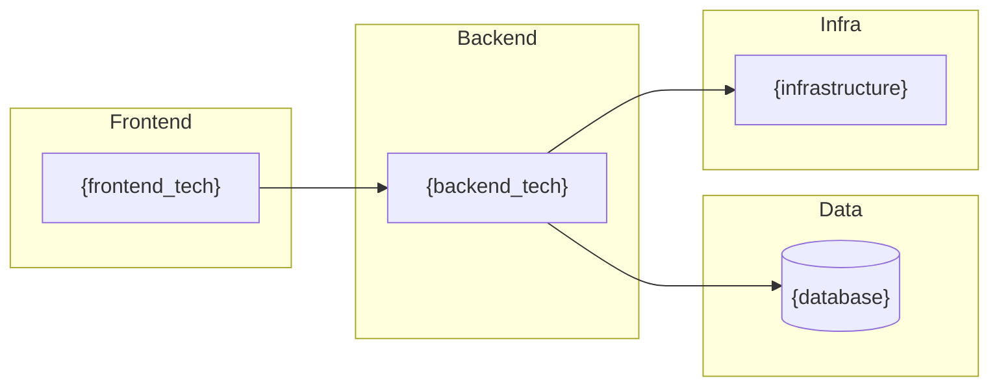

### Competitive positioning

```mermaid
quadrantChart
    title Competitive positioning matrix
    x-axis Low complexity --> High complexity
    y-axis Low market demand --> High market demand
    quadrant-1 Stars
    quadrant-2 Question marks
    quadrant-3 Dogs
    quadrant-4 Cash cows
    "{project_name}": [{x}, {y}]
    "{competitor_a}": [{x}, {y}]
    "{competitor_b}": [{x}, {y}]
```

---

# 🏗️ LAYER 2: Architecture Story

> Estimated reading time: 30–60 minutes

---

## 3. 🎬 How It Works (how the project runs)

### Core flow narrative

**One-liner**:
> User {trigger} → system {processing} → {final_result}

**Detail**:

{2–3 paragraphs on core runtime behavior}

### Main scenarios

#### Scenario 1: {scenario_name}

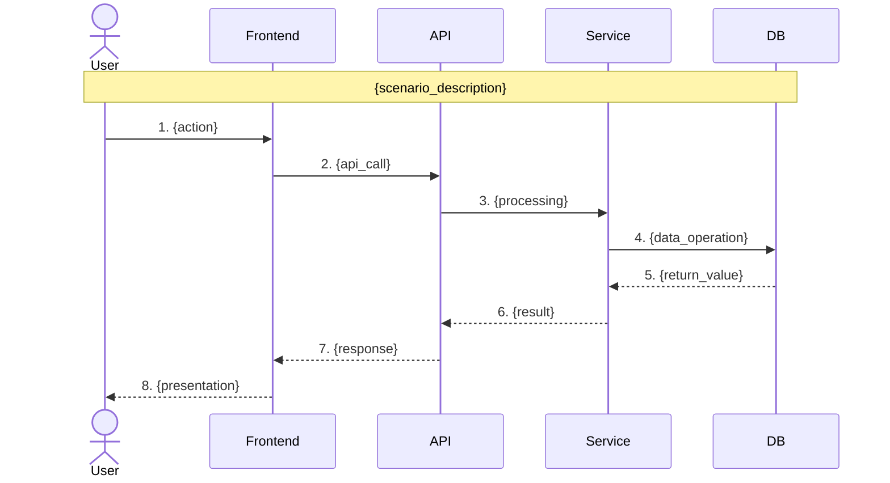

#### Scenario 2: {scenario_name}

```mermaid
sequenceDiagram
    {same_pattern_as_above}
```

### Key code entry points

| Stage | File | Function/class | Responsibility |
|------|----------|-----------|------|
| 🚪 Entry | `{file}:{line}` | `{function}` | {description} |
| 🛣️ Routing | `{file}:{line}` | `{function}` | {description} |
| ⚙️ Logic | `{file}:{line}` | `{function}` | {description} |
| 💾 Data | `{file}:{line}` | `{class}` | {description} |

### Core algorithms / logic

**{algorithm_name}**

Purpose: {problem_solved}

```
Pseudocode:
1. {step_1}
2. {step_2}
3. {step_3}
```

Code reference: `{file}:{start_line}-{end_line}`

---

## 4. Project Overview

### Basics

| Field | Value |
|------|------|
| Project name | {name} |
| Description | {description} |
| Primary languages | {language} ({percentage}%) |
| Lines of code | {total_loc} |
| License | {license} |
| Created | {created_at} |
| Last updated | {updated_at} |
| GitHub Stars | {stars} |
| Contributors | {contributors_count} |

### Tech stack summary

| Category | Technology | Version |
|------|------|------|
| Languages | {languages} | {versions} |
| Frameworks | {frameworks} | {versions} |
| Build | {build_tools} | {versions} |
| Test | {test_frameworks} | {versions} |
| Databases | {databases} | {versions} |
| Infrastructure | {infra} | - |

### Project lifecycle stage

```mermaid
flowchart LR
    A[🌱 Seed] --> B[📈 Growth]
    B --> C[🏢 Mature]
    C --> D[🔧 Maintenance]
    D --> E[📉 Decline]

    style {current_stage} fill:#4CAF50,color:#fff
```

**Current stage**: {stage_name}
**Rationale**: {stage_reason}

---

## 5. Architecture Analysis

### 5.1 System Context Diagram (C4 Level 1)

> **Caption**: {2–3 sentences on what this diagram shows}

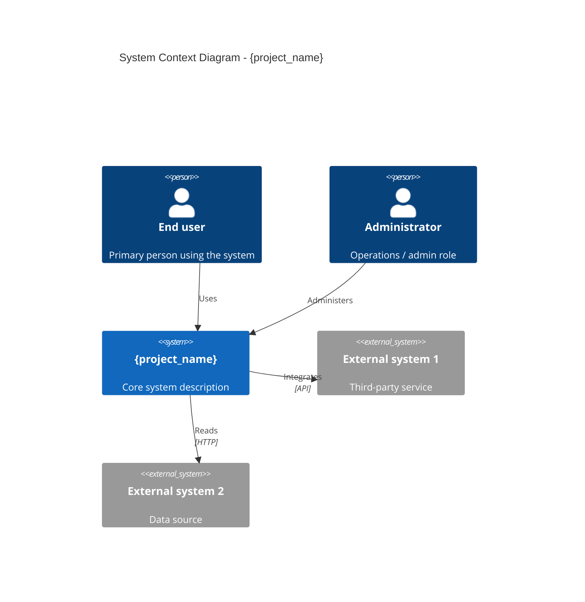

### 5.2 Container Diagram (C4 Level 2)

> **Caption**: {2–3 sentences on what this diagram shows}

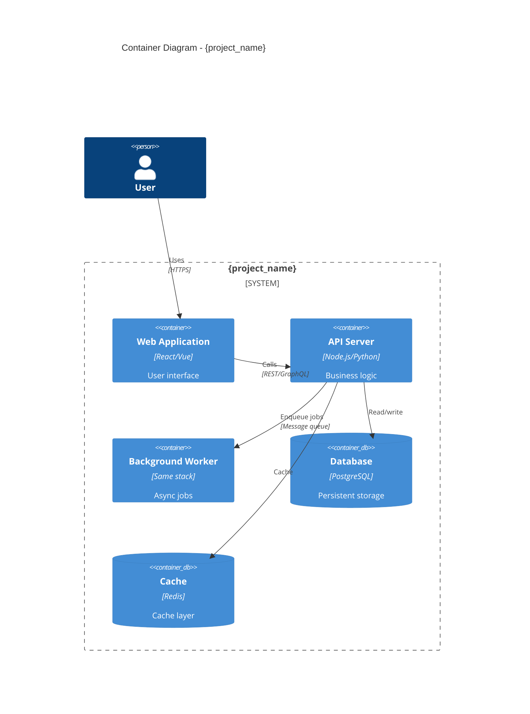

### 5.3 Component Diagram (C4 Level 3)

> **Caption**: {2–3 sentences on what this diagram shows}

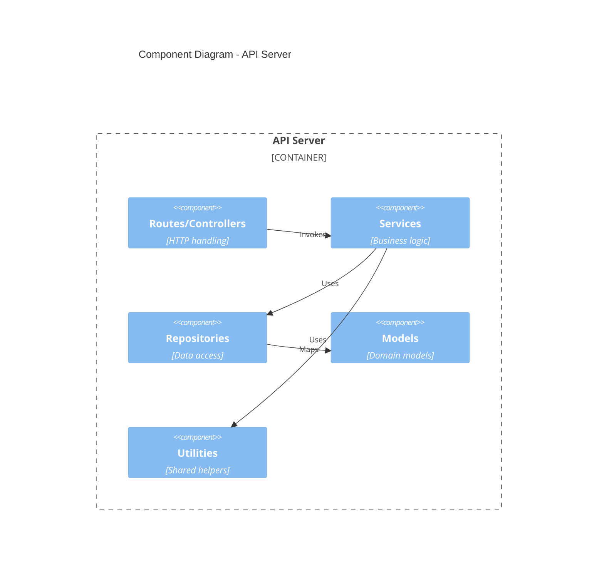

### 5.4 Architecture pattern identification

**Primary pattern**: {pattern_name}

| Pattern | Description | Fit |
|------|------|--------|
| {pattern1} | {description} | ✅ Strong |
| {pattern2} | {description} | ⚠️ Partial |
| {pattern3} | {description} | ❌ None |

### 5.5 Main components and responsibilities

| Component | Path | Responsibility | Dependencies |
|------|------|------|------|
| {component1} | `src/{path}` | {responsibility} | {deps} |
| {component2} | `src/{path}` | {responsibility} | {deps} |

### 5.6 Technology choices 🆕

> **Why these technologies?**

| Area | Choice | Rationale | Alternatives |
|------|------|------------|----------|
| Language | {lang} | {reason} | {alternatives} |
| Framework | {framework} | {reason} | {alternatives} |
| Database | {db} | {reason} | {alternatives} |
| Deployment | {deploy} | {reason} | {alternatives} |

### 5.7 Inferred architecture decision records (ADR)

| ADR | Decision | Likely reason | Impact |
|-----|------|----------|------|
| ADR-001 | Adopt {framework} | {reason} | {impact} |
| ADR-002 | Use {pattern} | {reason} | {impact} |

### 5.8 Directory layout

```
{project_name}/
├── src/                    # Source code
│   ├── components/         # UI components
│   ├── services/           # Business logic
│   ├── models/             # Data models
│   └── utils/              # Utilities
├── tests/                  # Tests
├── docs/                   # Documentation
├── config/                 # Configuration
└── package.json            # Package manifest
```

---

## 6. Quality Assessment

### 6.1 Eight-dimension chart


### 6.2 Dimension scores

#### 6.2.1 Maintainability ({score1}/100)

| Metric | Score | Notes |
|------|------|------|
| Code complexity | {sub_score} | Average cyclomatic complexity |
| Naming | {sub_score} | Consistency and readability |
| Modularity | {sub_score} | Single-responsibility adherence |
| Duplication | {sub_score} | DRY adherence |

**Strengths**: {strengths}
**Risks**: {risks}

#### 6.2.2 Testability ({score2}/100)

| Metric | Score | Notes |
|------|------|------|
| Test coverage | {coverage}% | Line/branch coverage |
| Test quality | {sub_score} | Usefulness of cases |
| Mocking | {sub_score} | Dependency isolation |

#### 6.2.3 Scalability ({score3}/100)

| Metric | Score | Notes |
|------|------|------|
| Architectural flexibility | {sub_score} | Ease of adding features |
| Horizontal scale | {sub_score} | Multi-instance readiness |
| Design patterns | {sub_score} | Extensibility patterns |

#### 6.2.4 Security ({score4}/100)

| Metric | Score | Notes |
|------|------|------|
| Dependency CVEs | {sub_score} | Count and severity |
| Sensitive data | {sub_score} | Exposure risk |
| Input validation | {sub_score} | Injection defenses |

#### 6.2.5 Documentation ({score5}/100)

| Metric | Score | Notes |
|------|------|------|
| README | {sub_score} | Project overview quality |
| API docs | {sub_score} | Interface documentation |
| Code comments | {sub_score} | Inline documentation |

#### 6.2.6 Architecture health ({score6}/100)

| Metric | Score | Notes |
|------|------|------|
| SOLID alignment | {sub_score} | Design principles |
| Separation of concerns | {sub_score} | Layer clarity |
| Dependency direction | {sub_score} | Dependency rules |

#### 6.2.7 Dependency health ({score7}/100)

| Metric | Score | Notes |
|------|------|------|
| Dependency count | {sub_score} | Direct dependencies |
| Version currency | {sub_score} | Outdated share |
| Cycles | {sub_score} | Circular dependency count |

#### 6.2.8 Developer experience ({score8}/100)

| Metric | Score | Notes |
|------|------|------|
| Onboarding difficulty | {sub_score} | Time to first contribution |
| Tooling | {sub_score} | Dev environment completeness |
| Error messages | {sub_score} | Actionability |

### 6.3 Strengths and risks

#### Strengths ✅
1. {strength1}
2. {strength2}
3. {strength3}

#### Risks ⚠️
1. {risk1}
2. {risk2}
3. {risk3}

---

## 7. Value & Competitive Analysis

### 7.1 Problems this project addresses

| Problem | Pain level | Alternatives today | This project’s edge |
|------|----------|--------------|------------|
| {problem1} | 🔴 High | {alternatives} | {advantage} |
| {problem2} | 🟠 Medium | {alternatives} | {advantage} |

### 7.2 Unique value proposition (UVP)

> **“{one_line_uvp}”**

Core value:
1. **{value1}** — {description}
2. **{value2}** — {description}
3. **{value3}** — {description}

### 7.3 Replaceability assessment

| Dimension | Score | Notes |
|------|------|------|
| Technical uniqueness | ★★★★☆ | {notes} |
| Ecosystem depth | ★★★☆☆ | {notes} |
| Migration cost | ★★★★☆ | {notes} |
| Learning curve | ★★★☆☆ | {notes} |
| Community vitality | ★★★★★ | {notes} |

**Overall replaceability score: {X.X}/5**

### 7.4 Competitor comparison matrix

> **Compare 3–6 primary competitors or alternatives**

| Dimension | This project | {competitor_a} | {competitor_b} | {competitor_c} |
|------|--------|---------|---------|---------|
| **Core features** | {description} | {description} | {description} | {description} |
| **Architecture** | {description} | {description} | {description} | {description} |
| **Extensibility** | ✅ Plugin system | ⚠️ Limited | ❌ None | ✅ Full |
| **Learning curve** | 🟡 Medium | 🟢 Low | 🔴 High | 🟡 Medium |
| **Community** | ⭐⭐⭐⭐ | ⭐⭐⭐⭐⭐ | ⭐⭐ | ⭐⭐⭐ |
| **Licensing** | MIT | Apache-2.0 | GPL-3.0 | Commercial |
| **Last updated** | {date} | {date} | {date} | {date} |

**When to choose what**:
- **This project** if: {fit_scenario}
- **{competitor_a}** if: {fit_scenario}
- **{competitor_b}** if: {fit_scenario}

### 7.5 Fit scenarios

> **Pie chart of best-fit use cases**

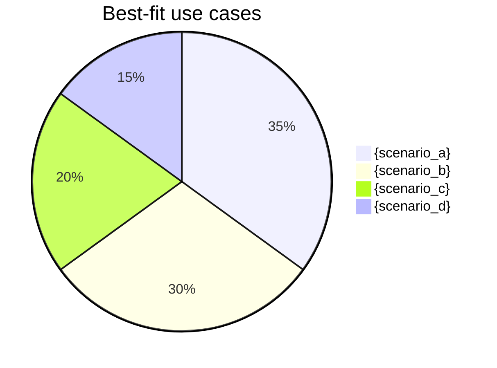

**Scenario notes**:

| Scenario | Fit index | Notes |
|------|----------|------|
| {scenario_a} | ⭐⭐⭐⭐⭐ | {why_strong_fit} |
| {scenario_b} | ⭐⭐⭐⭐ | {why_fit} |
| {scenario_c} | ⭐⭐⭐ | {constraints} |
| {scenario_d} | ⭐⭐ | {caveats} |

**Adoption guidance matrix**:

| Your situation | Guidance | Reason |
|----------|------|------|
| {situation_1} | 🟢 Strong fit | {reason} |
| {situation_2} | 🟡 Cautious | {reason} |
| {situation_3} | 🔴 Not recommended | {reason} |

### 7.6 Version history

> **If CHANGELOG or Git history exists, analyze evolution**

#### Timeline

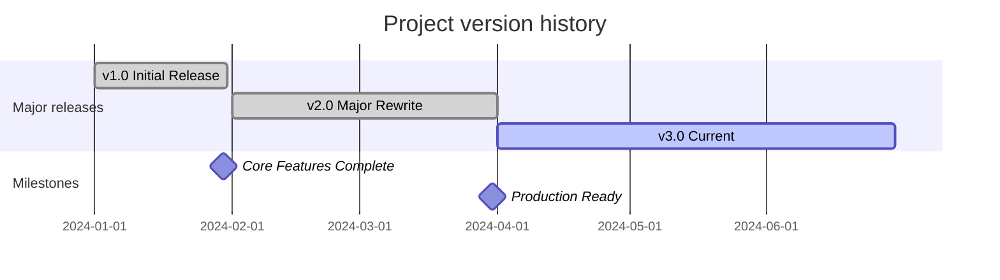

#### Milestones

| Version | Date | Highlights | Impact |
|------|------|----------|------|
| v1.0 | {date} | {feature_summary} | 🌱 Foundation |
| v2.0 | {date} | {feature_summary} | 📈 Major improvement |
| v3.0 | {date} | {feature_summary} | 🚀 Current stable |

#### Trends

- **Activity**: {high/medium/low}; {N} commits in the last 6 months
- **Release cadence**: about one release every {N} weeks
- **Breaking changes**: {M} breaking changes across the last {N} releases
- **Direction**: from Issues/Roadmap, expect {direction_summary}

---

# 🔬 LAYER 3: Deep Dive Reference

> Consult as needed; includes file:line references and actionable recommendations

---

## 8. Technical Debt Report

### 8.1 Debt overview

| Category | Items | Est. fix effort | Risk |
|------|--------|--------------|----------|
| Reliability debt | {count} | {days} person-days | 🔴 |
| Security debt | {count} | {days} person-days | 🔴 |
| Maintainability debt | {count} | {days} person-days | 🟠 |
| Performance debt | {count} | {days} person-days | 🟡 |
| Test debt | {count} | {days} person-days | 🟡 |
| **Total** | **{total}** | **{total_days} person-days** | - |

### 8.2 Debt detail (with code locations)

#### Reliability debt

| ID | Issue | Location | Risk | Fix effort |
|----|------|------|------|----------|
| TD-001 | {issue} | `{file}:{line}` | 🔴 | {hours}h |

#### Security debt

| ID | Issue | Location | Risk | Fix effort |
|----|------|------|------|----------|
| TD-002 | {issue} | `{file}:{line}` | 🔴 | {hours}h |

#### Maintainability debt

| ID | Issue | Location | Risk | Fix effort |
|----|------|------|------|----------|
| TD-003 | {issue} | `{file}:{line}` | 🟠 | {hours}h |

### 8.3 Priority matrix

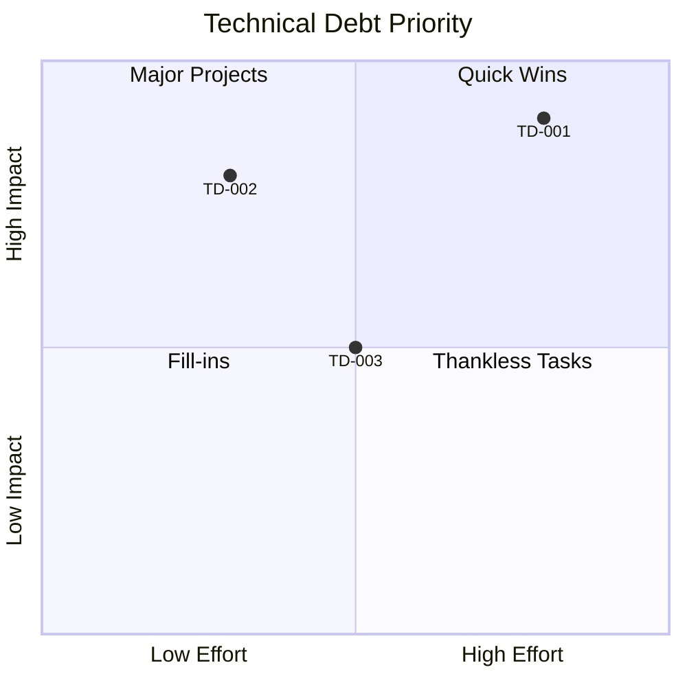

---

## 9. Dependency Analysis

### 9.1 Dependency overview

| Kind | Count |
|------|------|
| Direct | {direct_count} |
| Transitive | {transitive_count} |
| Dev | {dev_count} |
| **Total** | **{total_count}** |

### 9.2 Module dependency graph

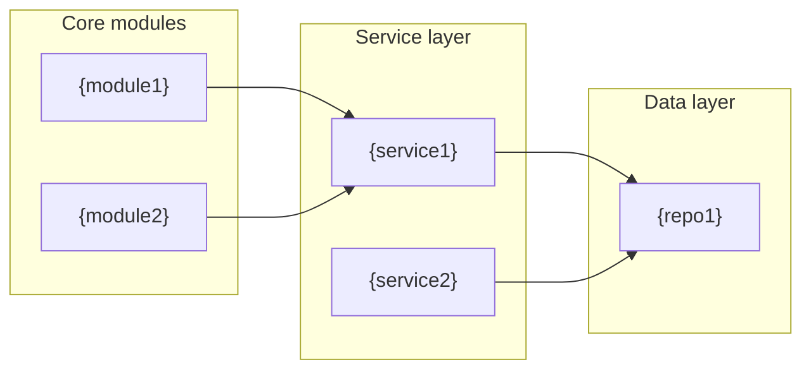

### 9.3 Dependency health

| Package | Current | Latest | Status | Risk |
|------|----------|----------|------|------|
| {package1} | {current} | {latest} | 🔴 CVE | Critical |
| {package2} | {current} | {latest} | 🟠 2+ versions behind | High |
| {package3} | {current} | {latest} | 🟡 Minor behind | Medium |
| {package4} | {current} | {latest} | ✅ Up to date | None |

### 9.4 Circular dependency warnings

| Cycle | Impact | Recommendation |
|----------|------|------|
| A → B → C → A | {impact} | {suggestion} |

### 9.5 License compliance

| License | Packages | Compliance risk |
|----------|--------|----------|
| MIT | {count} | ✅ None |
| Apache-2.0 | {count} | ✅ None |
| GPL-3.0 | {count} | ⚠️ Possible copyleft |
| Unknown | {count} | 🔴 Needs review |

---

## 10. Security Assessment

### 10.1 Security score: {score}/100

### 10.2 Vulnerability scan summary

| Severity | Count | Example |
|--------|------|------|
| 🔴 Critical | {count} | {example} |
| 🟠 High | {count} | {example} |
| 🟡 Medium | {count} | {example} |
| 🟢 Low | {count} | {example} |

### 10.3 OWASP Top 10 checklist

| Risk | Status | Notes |
|------|------|------|
| A01:2021 Broken Access Control | ✅/⚠️/🔴 | {detail} |
| A02:2021 Cryptographic Failures | ✅/⚠️/🔴 | {detail} |
| A03:2021 Injection | ✅/⚠️/🔴 | {detail} |
| A04:2021 Insecure Design | ✅/⚠️/🔴 | {detail} |
| A05:2021 Security Misconfiguration | ✅/⚠️/🔴 | {detail} |
| A06:2021 Vulnerable Components | ✅/⚠️/🔴 | {detail} |
| A07:2021 Authentication Failures | ✅/⚠️/🔴 | {detail} |
| A08:2021 Software and Data Integrity | ✅/⚠️/🔴 | {detail} |
| A09:2021 Logging Failures | ✅/⚠️/🔴 | {detail} |
| A10:2021 SSRF | ✅/⚠️/🔴 | {detail} |

### 10.4 Sensitive data review

| Type | Location | Risk | Recommendation |
|------|------|------|------|
| Exposed API key | `{file}` | 🔴 | Move to environment variables |
| Hard-coded password | `{file}` | 🔴 | Use a secrets manager |

---

## 11. 🛠️ Actionable Recommendations

> **Each recommendation: location → bad code → fix → verification**

### 11.1 Recommendations summary

| ID | Title | Category | Importance | Priority | Location |
|----|------|------|--------|--------|----------|
| REC-001 | {title} | Security | ⭐⭐⭐ | 🔴 | `{file}:{line}` |
| REC-002 | {title} | Architecture | ⭐⭐⭐ | 🟠 | `{file}:{line}` |
| REC-003 | {title} | Performance | ⭐⭐ | 🟡 | `{file}:{line}` |
| REC-004 | {title} | Quality | ⭐ | 🟢 | `{file}:{line}` |

### 11.2 Priority matrix

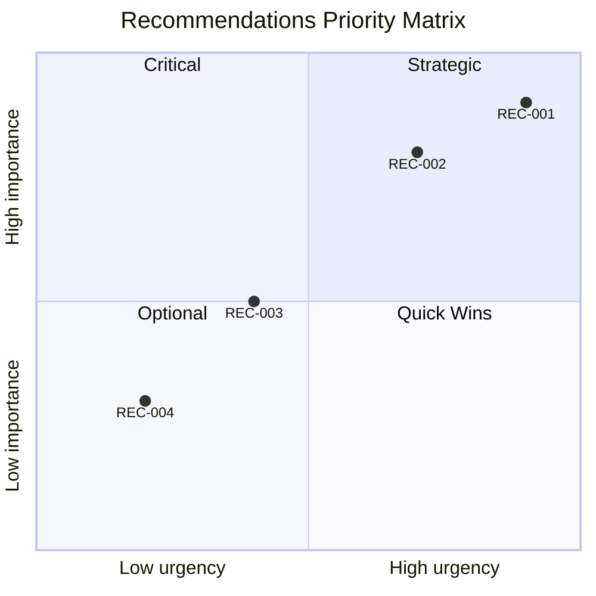

---

### 🔴 Address now

#### REC-001: {title}

| Attribute | Value |
|------|-----|
| Category | 🔒 Security |
| Importance | ⭐⭐⭐ Core |
| Priority | 🔴 Critical |

##### 📍 Location
- `{file1}:{line1}`
- `{file2}:{line2}`

##### ❌ Bad code
```{language}
// {file}:{line}
{problematic_code}
//   ^^^^^^^^^ {issue_summary}
```

##### ✅ Fix example
```{language}
// {file}:{line}
{fixed_code}
```

##### 🧪 Verification
```bash
# 1. {step_description}
{command1}

# 2. {step_description}
{command2}
# Expected: {expected}
```

##### ✓ Success criteria
- [ ] {criterion_1}
- [ ] {criterion_2}

---

### 🟠 Short term

#### REC-002: {title}

{same_structure_as_above}

---

### 🟡 Planned

#### REC-003: {title}

{same_structure_as_above}

---

### 🟢 When convenient

#### REC-004: {title}

{same_structure_as_above}

---

## 12. Appendix

### A. Full directory tree

```
{directory_tree}
```

### B. Key files

| File | Purpose | Importance |
|------|------|--------|
| `{file1}` | {purpose} | ⭐⭐⭐ |
| `{file2}` | {purpose} | ⭐⭐ |

### C. Glossary

| Term | Definition |
|------|------|
| {term1} | {definition} |
| {term2} | {definition} |

### D. Methodology

This report uses:

- **Architecture**: [arc42](https://arc42.org/) + [C4 Model](https://c4model.com/)
- **Technical debt**: [SQALE](https://www.sqale.org/)
- **Security**: [OWASP Top 10](https://owasp.org/www-project-top-ten/)
- **Quality**: Custom eight-dimension model

### E. Score-bar reference

```
█ = 10 points
░ = empty

100/100 = ██████████
90/100  = █████████░
80/100  = ████████░░
70/100  = ███████░░░
60/100  = ██████░░░░
50/100  = █████░░░░░
```

---

*Generated by Claude Code analyze-repo Skill v3.0*
*Analysis date: {YYYY-MM-DD}*
```

## Mermaid examples

### C4 Context Diagram (example)

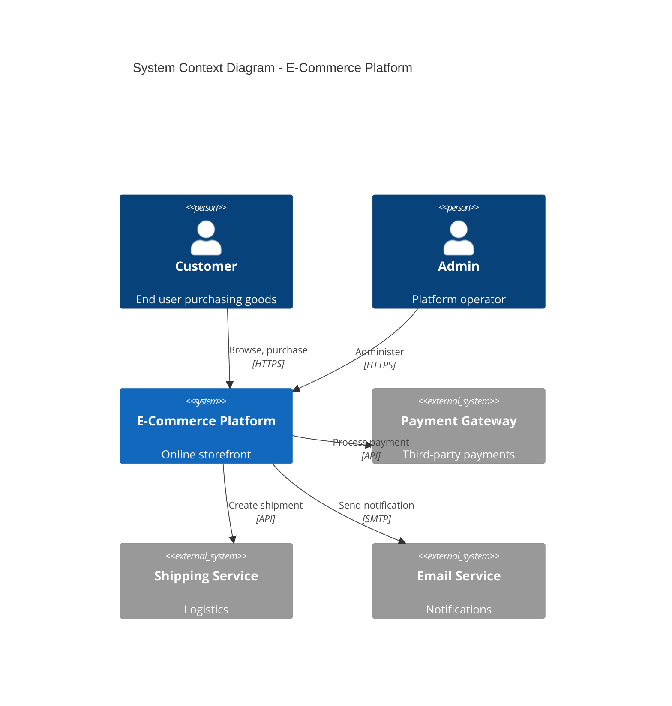

### Quality Radar Chart Alternative

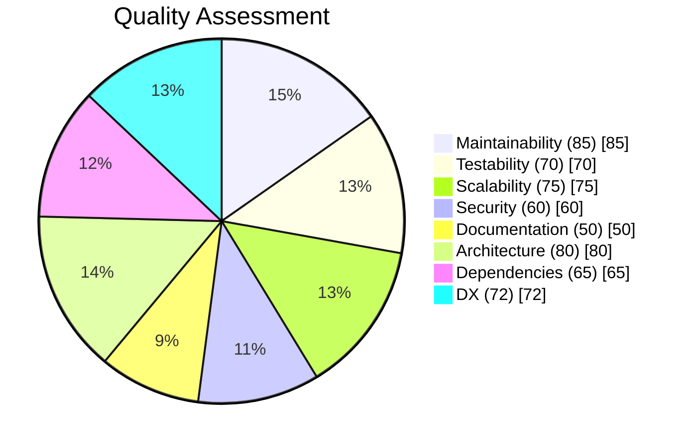

### Technical Debt Trend

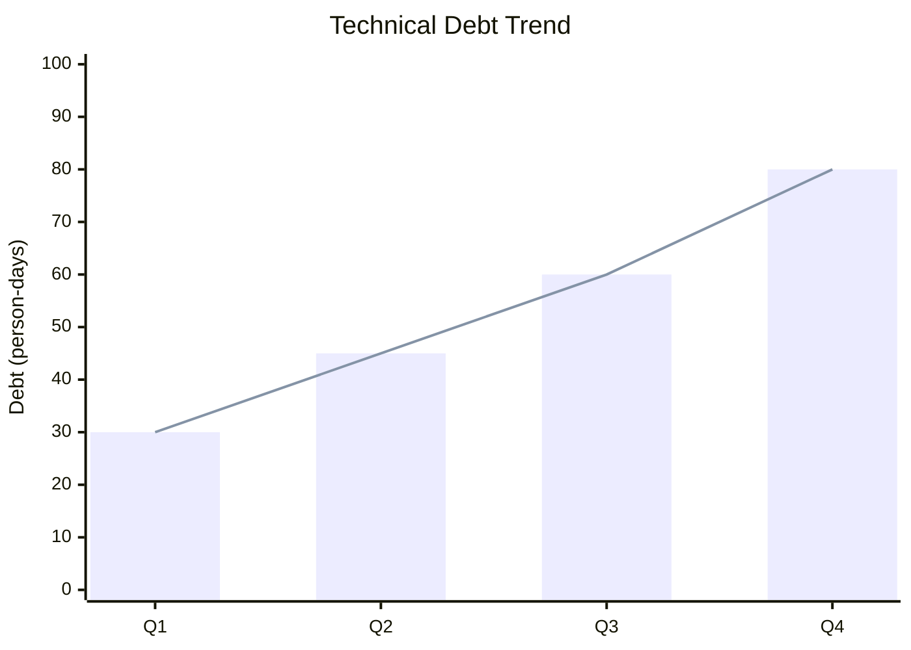

### Dependency Graph

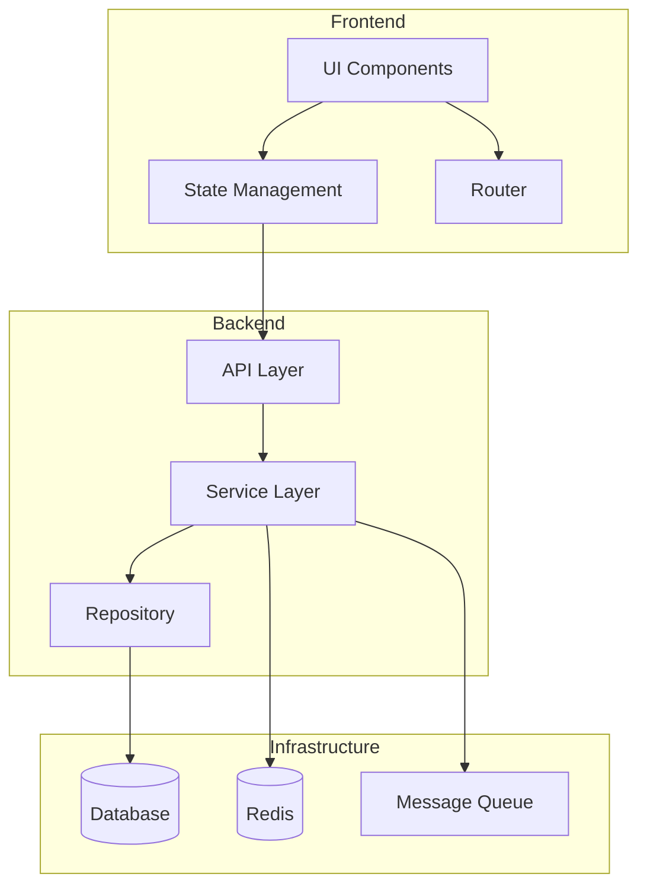
